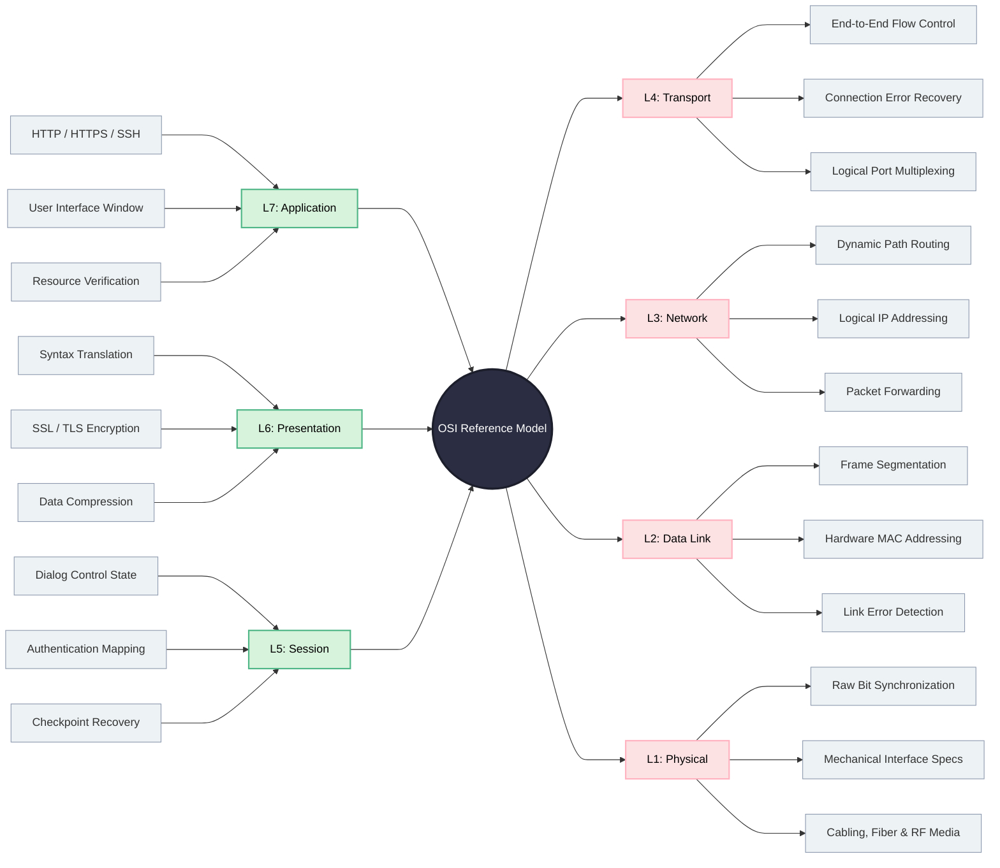

# The OSI Model
The Open Systems Interconnection (OSI) model is a 7-layer conceptual framework.
Standardizes how data moves across a network. 
It ensures interoperability between different hardware vendors and software applications.
Simplifies network design, implementation, and troubleshooting.

---

## 1. The 7 Layers At A Glance

| Layer | Name | Data Unit (PDU) | Primary Responsibility | Core Protocols / Tech |
| :---: | :--- | :---: | :--- | :--- |
| **7** | **Application** | Data | Human-computer interaction & network services | HTTP, HTTPS, SSH, FTP, SMTP |
| **6** | **Presentation**| Data | Data formatting, encryption, and compression | SSL/TLS, ASCII, JPEG, MPEG |
| **5** | **Session**      | Data | Authentication, session setup, and teardown | NetBIOS, RPC, SOCKS |
| **4** | **Transport**    | Segment / Datagram | End-to-end delivery, flow control, error recovery | TCP, UDP |
| **3** | **Network**      | Packet | Logical addressing and path determination (routing) | IPv4, IPv6, ICMP, IPsec |
| **2** | **Data Link**    | Frame | Physical addressing and media access control | Ethernet, Wi-Fi (802.11), MAC |
| **1** | **Physical**     | Bits | Raw transmission of electrical, optical, or radio signals | Cat6, Fiber, Hubs, Repeaters |

---

## 2. Data Flow Architecture (Encapsulation vs. Decapsulation)

Data changes form as it travels through the stack. 

* **Encapsulation (Sender):** Data moves **Down** (L7 to L1). Each layer adds a header ($H$) containing metadata.
* **Decapsulation (Receiver):** Data moves **Up** (L1 to L7). Each layer strips its corresponding header.

```
[SENDER]                                                          [RECEIVER]
  L7: Application  --> [ Data ]                                   L7: Application
  L6: Presentation --> [ H6 ][ Data ]                             L6: Presentation
  L5: Session      --> [ H5 ][ H6 ][ Data ]                       L5: Session
  L4: Transport    --> [ H4 ][ H5 ][ H6 ][ Data ]                 L4: Transport
  L3: Network      --> [ H3 ][ H4 ][ H5 ][ H6 ][ Data ]           L3: Network
  L2: Data Link    --> [ H2 ][ H3 ][ H4 ][ H5 ][ H6 ][ Data ][T2] L2: Data Link
  L1: Physical     -->  01101001 01110100 01110011 ------------>  L1: Physical
                        (Transmission Medium / Cable)
```

---

## 3. Layer-by-Layer Architecture

### Layer 7: The Application Layer
*   **Protocol Data Unit (PDU):** Data / Message
*   **Core Purpose:** Provides the primary interface for end-user applications to access network services.
*   **Key Responsibilities:** Identification of communication partners, resource availability assessment, and application synchronization.
*   **Common Protocols:** HTTP, HTTPS, FTP, SMTP, DNS, SSH, RDP.

### Layer 6: The Presentation Layer
*   **Protocol Data Unit (PDU):** Data
*   **Core Purpose:** Acts as the data translator for the network, ensuring compatibility between different data syntaxes.
*   **Key Responsibilities:**
	*   Data formatting/syntax translation
	*   Data compression for efficiency
	*   Standard encryption/decryption
*   **Common Examples:** SSL/TLS, ASCII, EBCDIC, JPEG, MPEG.

### Layer 5: The Session Layer
*   **Protocol Data Unit (PDU):** Data
*   **Core Purpose:** Establishes, manages, orchestrates, and terminates communication sessions between applications on distinct hosts.
*   **Key Responsibilities:**
	*   Dialog control (managing simplex, half-duplex, or full-duplex streams)
	*   Token management
	*   Checkpoint synchronization for recovery
	*   Session Management
*   **Common Protocols:** NetBIOS, RPC (Remote Procedure Call), PPTP.

### Layer 4: The Transport Layer
*   **Protocol Data Unit (PDU):** Segment (TCP) / Datagram (UDP)
*   **Core Purpose:** Manages end-to-end communication, ensuring complete, ordered, and error-free data transfer across the network.
*   **Key Responsibilities:**
	*   Service-point addressing (ports)
	*   Segmentation and reassembly
	*   Connection control
	*   Flow control
	*   Error correction
*   **Common Protocols:** TCP, UDP.

### Layer 3: The Network Layer
*   **Protocol Data Unit (PDU):** Packet
*   **Core Purpose:** Responsible for the delivery of individual packets from the original source host to the final destination host across multiple networks.
*   **Key Responsibilities:**
	*   Logical addressing (IP addressing),
	*   Routing (determining the best physical path),
	*   Packet forwarding.
*   **Common Protocols:** IPv4, IPv6, ICMP, OSPF, BGP, ARP.

### Layer 2: The Data Link Layer
*   **Protocol Data Unit (PDU):** Frame
*   **Core Purpose:** Transmits data reliably over a single physical link or hop between two directly connected nodes.
*   **Key Responsibilities:**
	*   Framing (appending headers/trailers)
	*   physical addressing (MAC addresses)
	*   hop-to-hop flow control
	*   error detection (CRC/FCS)
*   **Common Components:** Ethernet (802.3), Wi-Fi (802.11), Layer 2 Switches, PPP.

### Layer 1: The Physical Layer
*   **Protocol Data Unit (PDU):** Bit
*   **Core Purpose:** Transmits unstructured raw bitstreams over a physical communication medium.
*   **Key Responsibilities:**
	*   Defining mechanical and electrical specifications
	*    Bit synchronization
	*    Transmission modes (simplex/duplex)
	*    Physical topologies.
*   **Common Components:** Fiber optic cables, Cat6 Ethernet cables, Hubs, Repeaters, RF Antennas.

## 4. Radial Mind Map Diagram



### 5. References
- Books
	- [Computer Networks by Andrew S. Tanenbaum](https://networking.harshkapadia.me/files/books/computer-networks-tanenbaum-5th-edition.pdf)
	- Network Forensics - Tracking Hackers through Cyberspace by Sherri Davidoff & Jonathan Ham
